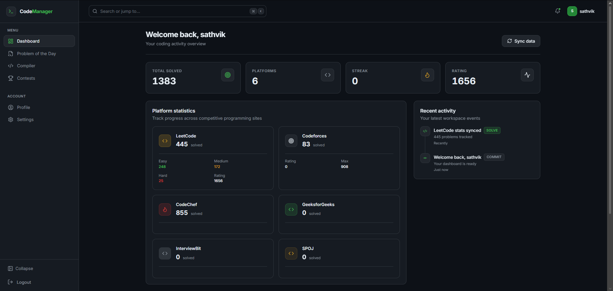
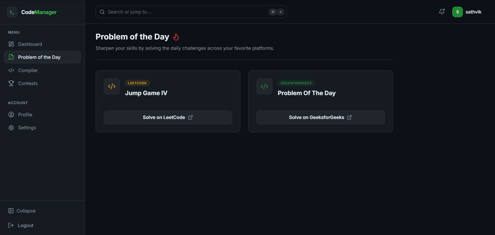
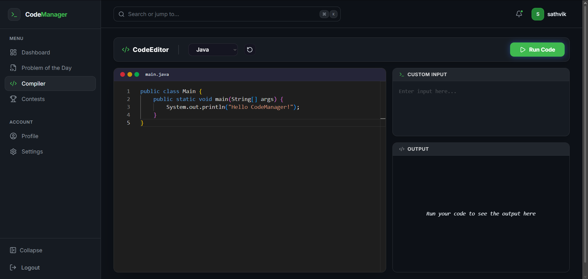
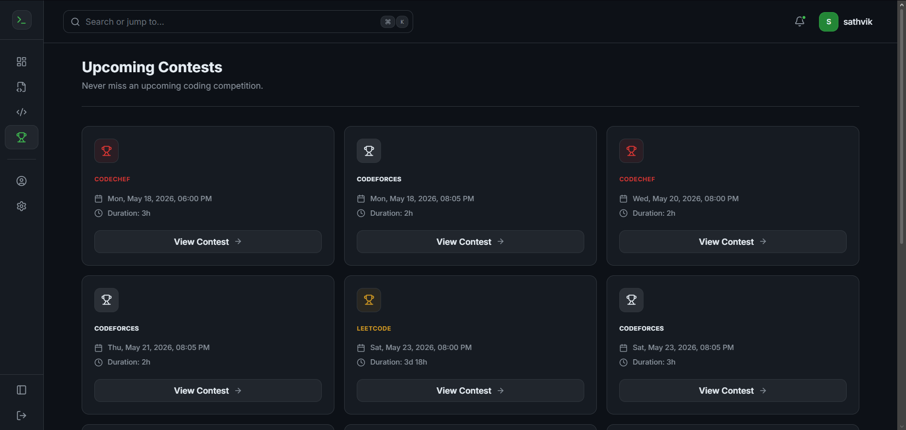
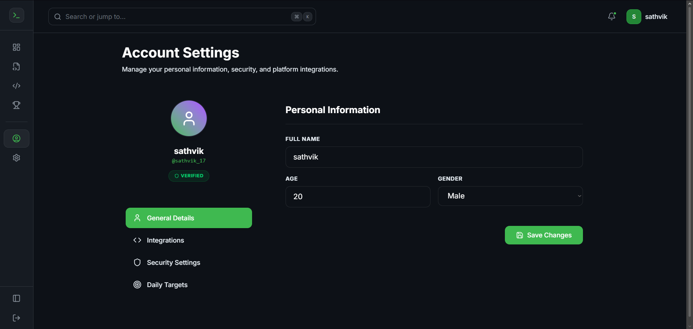

# CodeManager

**One dashboard for all your competitive programming profiles.**

CodeManager is a full-stack developer platform that aggregates stats from LeetCode, Codeforces, CodeChef, GeeksforGeeks, InterviewBit, and SPOJ — wrapped in a GitHub-inspired dark UI built for long coding sessions.

<p align="center">
  
</p>

---

## Features

| Area | What you get |
|------|----------------|
| **Unified dashboard** | Total solved, platform breakdown, ratings, and one-click sync |
| **Platform deep-dives** | Per-site stats, difficulty breakdown, and rating history charts |
| **Problem of the Day** | Daily challenges from LeetCode and GeeksforGeeks |
| **Online compiler** | Monaco editor with Java, Python, C++, C, and JavaScript (Docker-isolated) |
| **Contests** | Upcoming competitions across major platforms |
| **Profile & targets** | Account settings, platform usernames, security, and daily goals |
| **Auth** | Sign up, email verification, JWT sessions, forgot/reset password |

### Online Compiler Details

The compiler uses Docker containers for secure, isolated execution of your code. Supported languages and their Docker images:

| Language | Docker Image | Timeout |
|----------|--------------|---------|
| Python | `python:3.11` | 30s |
| Java | `eclipse-temurin:17` | 30s |
| C++ | `gcc:latest` | 30s |
| C | `gcc:latest` | 30s |
| JavaScript | `node:20` | 30s |

### UI highlights

- Dark-first layout with green accents (no blue-heavy theme)
- Collapsible sidebar, sticky navbar, command-palette search (`Ctrl`/`Cmd` + `K`)
- Card-based sections, activity timeline, toast notifications, skeleton loaders
- Fully responsive, component-based React + Tailwind design system

---

## Screenshots

<table>
  <tr>
    <td width="50%">
      <strong>Dashboard</strong><br/>
      
    </td>
    <td width="50%">
      <strong>Problem of the Day</strong><br/>
      
    </td>
  </tr>
  <tr>
    <td width="50%">
      <strong>Compiler</strong><br/>
      
    </td>
    <td width="50%">
      <strong>Contests</strong><br/>
      
    </td>
  </tr>
  <tr>
    <td colspan="2" align="center">
      <strong>Profile & account settings</strong><br/>
      
    </td>
  </tr>
</table>

---

## Tech stack

### Frontend (`frontend/`)

- React 19 · Vite 8 · React Router 7  
- Tailwind CSS 4 · Lucide icons · Framer Motion  
- Monaco Editor · Recharts · Axios · Zustand (state management)

### Backend (`CodingManager/`)

- Java 17 · Spring Boot 3.5  
- Spring Security · JWT (jjwt 0.11.5)  
- Spring Data MongoDB  
- JavaMail (SMTP) · WebSocket · Jsoup (web scraping) · Selenium

### Data & tooling

- MongoDB  
- Maven  
- Docker (for compiler isolation & execution)  

---

## Project structure

```
cm/
├── CodingManager/            # Backend (Spring Boot)
│   ├── src/main/
│   │   ├── java/com/sathvik/CodingManager/
│   │   │   ├── config/       # Application & Security config
│   │   │   ├── controller/   # API endpoints
│   │   │   ├── dto/          # Data Transfer Objects
│   │   │   ├── model/        # Database models (User, Platform stats, Contests, etc.)
│   │   │   ├── repository/   # MongoDB repositories
│   │   │   ├── security/     # JWT authentication
│   │   │   ├── service/      # Business logic (compiler, auth, fetchers, scheduler)
│   │   │   └── utils/        # Helper utilities
│   │   └── resources/
│   │       ├── application.yml
│   │       ├── application.yml.example
│   │       └── application-local.yml.example
│   └── pom.xml               # Maven dependencies
├── frontend/                 # Frontend (React SPA)
├── output/                   # README screenshots
└── README.md
```

---

## Getting started

### Prerequisites

- **Node.js** 18+ and npm  
- **Java** 17+ and Maven  
- **MongoDB** running locally (default: `mongodb://localhost:27017/codingmanager`)  
- **Docker** (required for online compiler functionality) - must be running on your system
- **Gmail app password** (or other SMTP) for email verification and password reset  

### 1. Clone the repository

```bash
git clone https://github.com/<your-username>/CodeManager.git
cd CodeManager
```

### 2. Backend configuration

Secrets are **not** committed. Use one of these approaches:

**Option A — Local YAML (recommended)**

```bash
cd CodingManager/src/main/resources
cp application-local.yml.example application-local.yml
# Edit application-local.yml with your JWT secret, mail credentials, etc.
```

Run with the `local` profile:

```bash
cd CodingManager
mvn spring-boot:run -Dspring-boot.run.profiles=local
```

**Option B — Environment variables**

| Variable | Description |
|----------|-------------|
| `JWT_SECRET` | Signing key for JWT tokens |
| `MAIL_USERNAME` | SMTP email address |
| `MAIL_PASSWORD` | SMTP app password |
| `CLIENT_URL` | Frontend URL (default `http://localhost:5173`) |

Copy `application.yml.example` for a full reference of all settings.

> **Note:** `application.properties` is gitignored. If you already use a local `application.properties`, it will continue to work on your machine — just never commit it.

### 3. Start the backend

```bash
cd CodingManager
mvn spring-boot:run
```

API runs at **http://localhost:8080**

### 4. Start the frontend

```bash
cd frontend
cp .env.example .env
npm install
npm run dev
```

App runs at **http://localhost:5173** (Vite proxies API routes to port 8080).

---

## API overview

| Method | Endpoint | Description |
|--------|----------|-------------|
| `POST` | `/api/signup` | Register a new user |
| `POST` | `/api/login` | Login |
| `POST` | `/api/verify-email` | Verify email token |
| `POST` | `/api/logout` | Clear auth cookie |
| `POST` | `/api/forgot-password` | Request reset link |
| `POST` | `/api/reset-password` | Reset password |
| `GET` | `/api/check-auth` | Current session |
| `GET` | `/platforms` | All platform stats |
| `GET` | `/platforms/{platform}` | Single platform stats |
| `POST` | `/platforms/refresh` | Sync all platforms |
| `POST` | `/platforms/refresh/{platform}` | Sync one platform |
| `GET` | `/contest` | Upcoming contests |
| `GET` | `/problem-of-the-day` | Daily problems |
| `POST` | `/compiler` | Run code |
| `GET` | `/profile` | User profile |
| `PUT` | `/profile/update-profile` | Update profile |

---

## Scripts

### Frontend

```bash
npm run dev      # Development server
npm run build    # Production build
npm run preview  # Preview production build
npm run lint     # ESLint
```

### Backend

```bash
mvn spring-boot:run   # Run application
mvn test              # Run tests
mvn package           # Build JAR
```

---

## Security

- Never commit `application.properties`, `application-local.yml`, or `.env` files with real credentials.  
- Rotate your **JWT secret** and **email app password** if they were ever pushed to a remote repository.  
- Use `application.yml.example` and `application-local.yml.example` as templates only.
"# CodeManager" 
